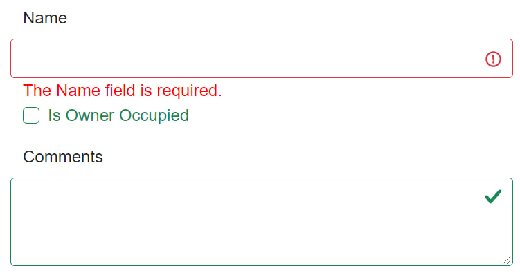

# Introducing Blazor Forms

Forms are a key of any web application as they provide a way to collect information from end-users. This information might range from the user details that we collect as part of a sign-up process down to a single textbox that allows users to leave comments or post messages in an collaborative application.

In this article we'll explain the benefits of Blazor forms, we'll look at their lifecycle and explain the fundamental concepts used to create and extend forms using Blazor.

The article is divided into the following sections:

1. [Form Fundamentals](#fundamentals)
2. [Introducing Blazor Forms](#blazor-forms)
3. [Blazor Component Model](#component-model)
4. [Extending Input Components](#extending-components)
5. [Validation](#validation)
6. [Extending Validation Components](#extending-validation)

## <a name="fundamentals"></a> Form Fundamentals

Let's assume that we are building a Contact form which has two fields (Name and Email) and a button to submit the form. In ASP.NET MVC, the code required to build such a form might look like this.

```html
<form asp-controller="Home" asp-action="Register" method="post">
  <label asp-for="ContactDetails.Name" class="form-label">Name</label>
  <input asp-for="ContactDetails.Name" class="form-control" type="text" />
  <span asp-validation-for="ContactDetails.Name" class="text-danger"></span>

  <label asp-for="ContactDetails.Email" class="form-label">Email address</label>
  <input asp-for="ContactDetails.Email" class="form-control" />
  <span asp-validation-for="ContactDetails.Email" class="text-danger"></span>

  <button class="btn btn-primary mt-3" type="submit">Submit</button>
</form>
```

The form defines an HTTP method and an endpoint to which the data is sent. It uses ASP.NET tag helpers to render the correct types of input controls and validation messages based on data annotations on the underlying `ContactDetails` model.

One problem with this solution is that when the form submits, a full page refresh is required as the server now needs to send a full HTTP payload to the client. To avoid this, one could use the approach offered by SPA solutions which abstract and simplify common tasks such as managing the state of fragments of pages away from the developer.

However, the separation of client and server-side code introduces further complexity, such as needing to deal with data type differences and other mismatches between server and client components.

With Blazor, developers write end-to-end solutions using .NET. This removes the technology mismatches and provides the following benefits:

- The same data types are used through the entire roundtrip of a request
- No additional endpoints are needed to process form submissions
- No need to deal with intermediary formats such as JSON to pass data between the front and back-end
- Reusing validation code on the server and client

## <a name="blazor-forms"></a> Introducing Blazor Forms

Blazor comes with an `EditForm` component that offers a comprehensive system for building rich forms with flexible validation efficiently. The `EditForm` can be easily extended to meet unique requirements without the need for third-party dependencies.

Converting the previous form to a Blazor `EditForm` results in the following code and markup.

```html
<EditForm Model="@ContactDetails" OnSubmit="@FormSubmitted">
  <DataAnnotationsValidator />

  <label for="@nameof(ContactDetails.Name)" class="form-label">Name</label>
  <InputText Class="form-control" @bind-Value="ContactDetails.Name" />
  <ValidationMessage For="ContactDetails.Name" />

  <label for="@nameof(ContactDetails.Email)" class="form-label">Email</label>
  <InputText Class="form-control" @bind-Value="ContactDetails.Email" />
  <ValidationMessage For="ContactDetails.Email" />

  <button class="btn btn-primary mt-3" type="submit">Submit</button>
</EditForm>
```

Although the structure of the mark-up looks very similar for both the Blazor and MVC code, the key points to highlight in the Blazor code are:

- **EditForm** defines a Blazor component which renders a `<form>` element under-the-hood.

- The **Model** attribute lets us bind an object to our form which gets updated whenever changes are made.

- **OnSubmit** configures a local method which gets triggered when the form is submitted. _Note: Blazor also provides us `OnValidSubmit` and `OnInvalidSubmit` convenience methods_.

- **InputText** a Blazor component representing a HTML `<input>` element. It uses the `@bind-Value` attribute to describe which property the component should bind to on the model.

- **DataAnnotationsValidator** and **ValidationMessage** elements attach our form to validation support and display any associated validation warnings to the user.

In the Blazor example, there is no separate Controllers or Actions required and all code is written using C# and .NET.

## <a name="component-model"></a> Blazor Component Model

Now that we've seen how to structure a Blazor form, it's worth diving a little deeper to demystify the `EditForm` and its related child elements.

All Blazor form elements we've seen, including the [EditForm](https://github.com/dotnet/aspnetcore/blob/main/src/Components/Web/src/Forms/EditForm.cs), inherit from the abstract [ComponentBase](https://docs.microsoft.com/en-us/dotnet/api/microsoft.aspnetcore.components.componentbase?view=aspnetcore-5.0) class. Blazor builds on top of the `ComponentBase` class to provide us with a handy set of built-in components that align to each of the standard HTML input types. The base class for each of these is the `InputBase` class as shown in the following class hierarchy diagram.


A component that plays a key role in Blazor's forms is the `EditContext`. It maintains the state and coordinates the form's lifecycle and events.

When a form is instantiated, the `Model` is set as the default state and the `EditContext` is [cascaded](https://docs.microsoft.com/en-us/aspnet/core/blazor/components/cascading-values-and-parameters?view=aspnetcore-5.0) to child elements in the form hierarchy.

At runtime, the `EditContext` handles change events and notifies the other components to update their own state before the form is then re-rendered.


## <a name="extending-components"></a> Extending Input Components

There may be times where you need to create your own custom components. For example, it is common to use custom components to encapsulate and simplify repetitive chunks of code. In Blazor this is as simple as creating a Razor component with whatever markup and logic is required.

The following component consolidates the markup to render Bootstrap form element groups. This removes repetitve code and makes it easier to maintain and enforce consistency across an application.

```html
@inherits InputText

<div class="form-group">
  @if (!string.IsNullOrWhiteSpace(Label)) {
  <label class="form-control-label" for="@Id">@Label</label>
  }

  <InputText
    Class="form-control"
    placeholder="@Label"
    Value="@Value"
    ValueChanged="@ValueChanged"
    ValueExpression="@ValueExpression"
  ></InputText>
</div>
```

In the example we inherit from `InputText` which is a good fit for this use case as it reduces the need to write custom code. You can extend from other classes in the component inheritance hierarchy depending on your specific customization needs.

Our custom `BootstrapInput` component is shown here being used in a form with a binding to `ContactDetails.Name`.

```html
<EditForm Model="@ContactDetails" OnSubmit="@FormSubmitted">
  <BootstrapInput @bind-Value="ContactDetails.Name" />

  <button class="btn btn-primary mt-3" type="submit">Submit</button>
</EditForm>
```

Before building your own custom components, it's worth checking out the comprehensive range of third-party components that are available via NuGet. These include specialized libraries of components such as:

- [Blazored](https://github.com/Blazored) component library which includes controls that allow users to enter and view Markdown in forms
- [Telerik](https://www.telerik.com/blazor-ui)'s Blazor component is a comprehensive library of components that can be used to create very customized solutions
- [MudBlazor](https://mudblazor.com/) component library inspired by Google's Material design language and written entirely in C#

## <a name="validation"></a> Validation

In the Blazor form shown earlier, we saw that **DataAnnotationsValidator** and **ValidationMessage** elements had been added to provide validation support based on [Data Annotations](https://docs.microsoft.com/en-us/dotnet/api/system.componentmodel.dataannotations?view=net-5.0).

```html
<EditForm Model="@ContactDetails" OnValidSubmit="@FormSubmitted">
  <DataAnnotationsValidator />
  ...
</EditForm>
```

The following summary describes each of the built-in validation components that Blazor provides.

| Validation Component                                                                                                                                                                 | Usage                                                                                                                                                                                                            |
| ------------------------------------------------------------------------------------------------------------------------------------------------------------------------------------ | ---------------------------------------------------------------------------------------------------------------------------------------------------------------------------------------------------------------- |
| [`<ValidationSummary>`](https://docs.microsoft.com/en-us/dotnet/api/microsoft.aspnetcore.components.forms.validationsummary?view=aspnetcore-5.0)                                     | Show validation error messages as a group at a set position on the page                                                                                                                                          |
| [`<ValidationMessage>`](https://docs.microsoft.com/en-us/dotnet/api/microsoft.aspnetcore.components.forms.validationmessage-1?view=aspnetcore-5.0)                                   | Show validation error messages for an individual input element at set positions within the page                                                                                                                  |
| [`<DataAnnotationsValidator>`](https://docs.microsoft.com/en-us/dotnet/api/microsoft.aspnetcore.components.forms.dataannotationsvalidator?view=aspnetcore-5.0)                       | Applies validation rules based on Data Annotations at runtime                                                                                                                                                    |
| [`<ObjectGraphDataAnnotationsValidator>`](https://docs.microsoft.com/en-us/aspnet/core/blazor/forms-validation?view=aspnetcore-5.0#nested-models-collection-types-and-complex-types) | Applies validation rules similar to DataAnnotationsValidator except that it traverses nested properties within an object hierarchy of the given model. Note that this need to be added as a separate dependency. |

Validation components access the `EditContext` to validate the `Model` and write any error messages to a [ValidationMessageStore](https://github.com/dotnet/aspnetcore/blob/edc1ca88e17e6cb60a5ea0966d751075d35111b9/src/Components/Forms/src/ValidationMessageStore.cs) for each related field. You can see the code for how this is done [here](https://github.com/dotnet/aspnetcore/blob/edc1ca88e17e6cb60a5ea0966d751075d35111b9/src/Components/Forms/src/EditContextDataAnnotationsExtensions.cs#L36).

Form fields then also access the same `ValidationMessageStore` looking for any associated errors when determining how to render their own state. The following image shows the Email field highlighted in red, indicating to the user that it is in an invalid state.


In addition to the styled warnings, you can add `ValidationMessage` and `ValidationSummary` components to your form to display detailed messages about errors to the user at relevant positions on the form. As you may have already guessed, both of these components also access the `ValidationMessageStore` to access error messages.

## <a name="extending-validation"></a> Extending Validation Components

In certain situations, you might want to customize the error styles to conform to your design system. For example, suppose you're building your applications with Bootstrap. You might want to apply Bootstrap validation styles to improve the user experience.



This can be done by extending the `FieldCssClassProvider` class and overriding its `GetFieldCssClass` method to apply your own specific styles based on the state of the field. The following piece of code shows how easily this is done.

```csharp
public class BootstrapStyleProvider : FieldCssClassProvider
{
    public override string GetFieldCssClass(EditContext editContext, in FieldIdentifier fieldIdentifier)
    {
        var isValid = !editContext.GetValidationMessages(fieldIdentifier).Any();

        return isValid ? "is-valid was-validated" : "is-invalid was-validated";
    }
}
```

This provider can then be registered with the `EditContext` as shown below.

```csharp
protected override void OnInitialized()
{
    _editContext = new EditContext(_contactDetails);
    _editContext.SetFieldCssClassProvider(new BootstrapStyleProvider());
    _editContext.OnFieldChanged += HandleFieldChanged;
}
```

The CSS classes you return are not limited to only Bootstrap; you could return classes for Material UI, or even your own custom design system.

Now, suppose your also want to use custom validation logic that goes beyond what DataAnnotations provide. In addition to providing our custom field styles, Blazor allows us to provide our own custom validators.

To achieve this we first create a class that extends from `ComponentBase` so that we have access to the form's cascaded `EditContext`. We can then tap into `OnValidationRequested` and `OnFieldChanged` events to call into our own validation logic.

```csharp
public class CustomValidator : ComponentBase
{
    [CascadingParameter] EditContext CurrentEditContext { get; set; }

    protected override void OnInitialized()
    {
        var messages = new ValidationMessageStore(CurrentEditContext);
        CurrentEditContext.OnValidationRequested +=
    (sender, eventArgs) => ValidateModel((EditContext)sender, messages);

        CurrentEditContext.OnFieldChanged +=
    (sender, eventArgs) => ValidateField(editContext, messages, eventArgs.FieldIdentifier);
    }

    // TO DO: provide your logic for doing model and field validation
}
```

We can then use this validator component as shown here in the markup below.

```html
<EditForm Model="@ContactDetails" OnValidSubmit="@FormSubmitted">
  <CustomValidator />
  ...
</EditForm>
```

This kind of extensibility has given rise to great third-party validators such as [Blazored.FluentValidation](https://github.com/Blazored/FluentValidation) which leverages [FluentValidation](https://fluentvalidation.net/).

If you are interested in learning about this, Chris Sainty has written [an in-depth article](https://chrissainty.com/using-fluentvalidation-for-forms-validation-in-razor-components/) explaining how to approach it.

## Wrapping it up

In this article we have given an overview of the fundamental concepts of Blazor forms.

We compared ASP.NET MVC forms to Blazor forms. We then looked at the fundamental concepts required to understand how to use form inputs and validation and saw how to extend and customize them to our own needs.
