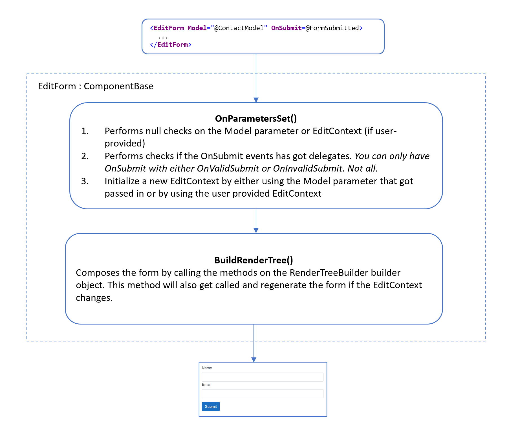
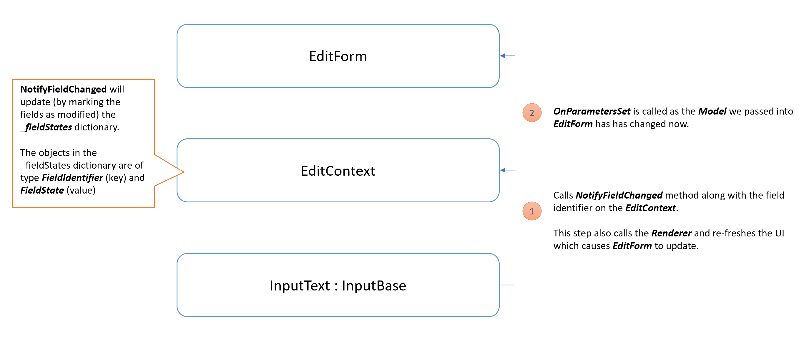
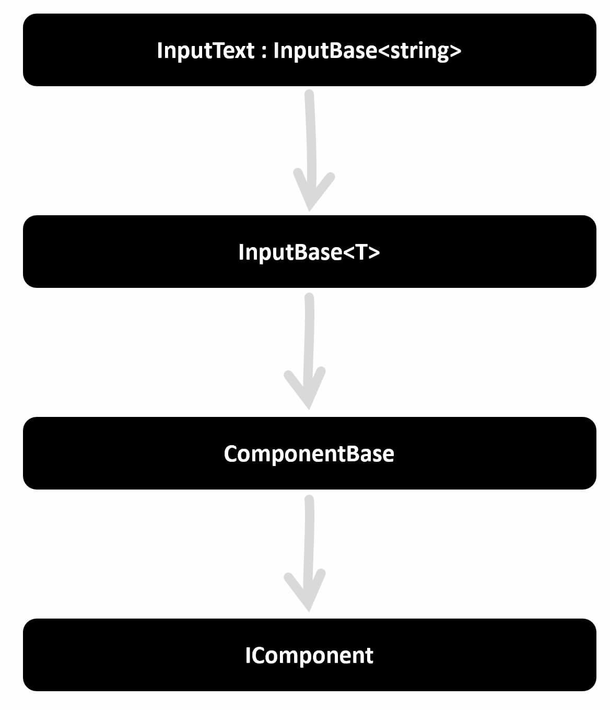
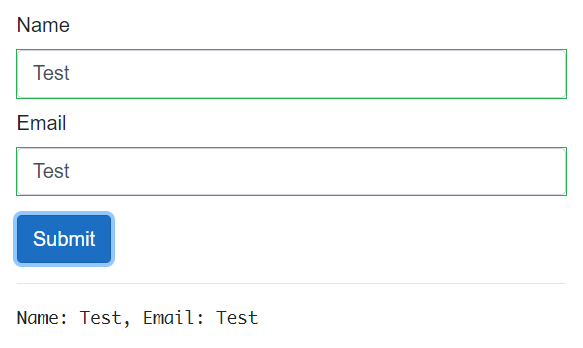
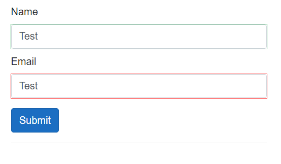
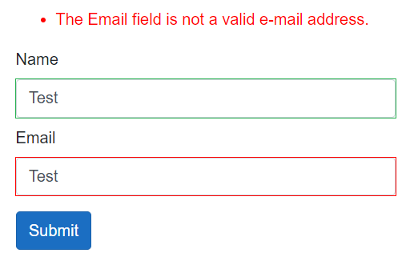
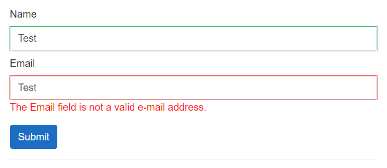

# Introducing Blazor Forms

Forms are a key of any web application as they provide a way to collect information from end-users. This information might range from the user details that we collect as part of a sign-up process down to a single textbox that allows users to leave comments or post messages in an collaborative application.

In this article we'll explain the benefits of Blazor forms, we'll look at their lifecycle and explain the fundamental concepts used to create and extend forms using Blazor.

## Form Fundamentals

Let's assume that we are building a Contact form which has two fields (Name and Email) and a button to submit the form. In ASP.NET MVC the code required to build such a form might look like this.

```html
<form asp-controller="Home" asp-action="Register" method="post">
  <label asp-for="Contact.Name" class="form-label">Name</label>
  <input asp-for="Contact.Name" class="form-control" type="text" />
  <span asp-validation-for="Contact.Name" class="text-danger"></span>

  <label asp-for="Contact.Email" class="form-label">Email address</label>
  <input asp-for="Contact.Email" class="form-control" />
  <span asp-validation-for="Contact.Email" class="text-danger"></span>

  <button class="btn btn-primary mt-3" type="submit">Submit</button>
</form>
```

The form defines an HTTP method and an endpoint to which the data is sent and it uses ASP.NET tag helpers to render the correct types of input controls and validation messages based on data annotations on the underlying `Contact` model.

One problem with this solution is that when the form submits, a full page refresh is required. This requires a full HTTP payload to be sent back to the client. In addition to this excessive payload, the full page refresh interrupts the users' experience. For example, the newly loaded page may result in the scroll position changing thus requiring the user to scroll to where they left off!

To avoid these issues, we could write client-side code to post the form, handle the response, and update only a specific fragment of the page. This is the approach offered by SPA solutions which abstract and simplify common tasks such as managing the state of fragments of pages away from the developer.

As we move away from a server-side only approach, we need to bring in third-party libraries and write code to make the HTTP requests, display validation errors correctly and parse data from JSON response messages.

The separation of client and server-side code introduces further complexity such as needing to deal with data type differences and other mismatches between server and client components.

With Blazor, developers write end-to-end solutions using .NET. This removes the technology mismatches and provides the following benefits:

- The same data types are used through the entire roundtrip of a request
- No additional endpoints are needed to process form submissions
- No need to deal with intermediary formats such as JSON to pass data between the front and back-end
- Reusing validation code on the server and client

## Introducing Blazor Forms

Converting the previous form to Blazor results in the following code and markup.

```html
<EditForm Model="@ContactModel" OnSubmit="@FormSubmitted">
  <DataAnnotationsValidator />

  <label for="@nameof(Contact.Name)" class="form-label">Name</label>
  <InputText Class="form-control" @bind-Value="ContactModel.Name"></InputText>
  <ValidationMessage For="ContactModel.Name" />

  <label for="@nameof(Contact.Email)" class="form-label">Email</label>
  <InputText Class="form-control" @bind-Value="ContactModel.Email"></InputText>
  <ValidationMessage For="ContactModel.Email" />

  <button class="btn btn-primary mt-3" type="submit">Submit</button>
</EditForm>

@code { public Contact ContactModel { get; set; } = new(); void FormSubmitted()
{ Logger.LogInformation($"Name: {ContactModel.Name}, Email:
{ContactModel.Email}"); // You could call your Web API endpoints or services
here // Eg: await Http.SendJsonAsync(HttpMethod.Post, "/api/Contact/Create",
ContactModel); } }
```

Although the structure of the mark-up looks very similar for both the Blazor and MVC code, the key points to highlight in the Blazor code are:

- **EditForm** defines a Blazor component which renders a `<form>` element under-the-hood.

- The **Model** attribute lets us bind an object to our form which gets updated whenever we make changes to the form.

- **OnSubmit** configures a local method which gets triggered when the form is submitted. _Note: Blazor also provides us `OnValidSubmit` and `OnInvalidSubmit` convenience methods_.

- **InputText** a Blazor component representing a HTML `<input>` element. It uses the `@bind-Value` attribute to describe which property the component should bind to on the model.

- **DataAnnotationsValidator** and **ValidationMessage** elements attach our form to validation support and display any associated validation warnings to the user.

In the Blazor example, there is no separate Controller/Action and all code is written using C# and .NET.

## Blazor Component Model

Now that we've seen how to structure a Blazor form, it's worth diving a little deeper to demystify the `EditForm` and its related child elements.

All Blazor form elements we've seen, including the [EditForm](https://github.com/dotnet/aspnetcore/blob/main/src/Components/Web/src/Forms/EditForm.cs), inherit from the abstract [ComponentBase](https://docs.microsoft.com/en-us/dotnet/api/microsoft.aspnetcore.components.componentbase?view=aspnetcore-5.0) class. This class provides the default implementation required to participate in Blazor's state management, events, and page lifecyle.

The following diagram shows how the `EditForm` renders a form using some of the standard component lifecycle events and hooks.



At runtime, Blazor handles events that fire in reponse to interactions and notifies all child elements in the form's component hierarchy.



As the form's child components are notified, they are given the chance to update their own state before the form is then re-rendered.

## Custom input components

Blazor builds on top of the `ComponentBase` class to provide us with a handy set of built-in components that align to each of the standard HTML input types.

We can create custom components by extending from an existing component or by building new types of input components from the ground up.

The following code snippet creates a razor component that consolidates the markup required for a styled search textbox so that it is easier to reuse and to help enforce consistency across an application.

```html
@inherits InputText

<div class="form-group">
  <div class="input-group-text"><i class="fas fa-search"></i></div>
  <InputText
    Class="form-control"
    placeholder="Search"
    Value="@Value"
    ValueChanged="@ValueChanged"
    ValueExpression="@ValueExpression"
  ></InputText>
</div>
```

In this example we are extending the `InputText` component which is the logical equivalent of a HTML input text element. This suits the needs for this search component as we are logically presenting a single text input element to the user. You can choose to extend from other classes in the inheritance hierarchy depending on your own specific customization needs.



The following code snippet shows our `SearchTextbox` being used in a form with a binding to the `ContactDetails.Name` property of the forms model.

```html
<EditForm Model="@ContactDetails" OnSubmit="@FormSubmitted">
  <SearchTextbox @bind-Value="ContactDetails.Name"></SearchTextbox>

  <button class="btn btn-primary mt-3" type="submit">Submit</button>
</EditForm>
```

Before building your own custom components, it's worth checking out the comprehensive range of third-party components that are available via NuGet. These include specialized libraries of components such as:

- [Blazored](https://github.com/Blazored) component library which includes controls that allow users to enter and view Markdown in forms
- [Telerik](https://www.telerik.com/blazor-ui)'s Blazor component is a comprehensive library of components that can be used to create very customized solutions
- [MudBlazor](https://mudblazor.com/) component library inspired by Google's Material design language and written entirely in C#

## Validation

Now that we understand how a form is constructed in Blazor, we'll take a brief look at form validations. Let's build on top of our previous example and validate the input fields. Just as in ASP.NET MVC or Razor pages, we can use [Data Annotations](https://docs.microsoft.com/en-us/aspnet/core/mvc/models/validation?view=aspnetcore-5.0) to decorate our model parameters.

> Note: Make sure to add `Microsoft.AspNetCore.Mvc.DataAnnotations` NuGet package to your project if your models are on a .NET Standard library project.

We will add the following annotations to our model.

```csharp
public class Contact
{
    [Required]
    public string Name { get; set; } = "";

    [Required]
    [EmailAddress]
    public string Email { get; set; } = "";
}
```

All supported data annotations can be found [here](https://docs.microsoft.com/en-us/dotnet/api/system.componentmodel.dataannotations?view=net-5.0).

In the markup for the form, we previously configured the OnSubmit handler. This handler is triggered every time we submit the form whether it's valid or not. With Blazor forms, we can change this to OnValidSubmit to ensure that a user can only submit the form if validation passes.

```html
<EditForm Model="@ContactModel" OnValidSubmit="@FormSubmitted"> ... </EditForm>
```



As you can see in the above image, the fields appear with a green border which indicates the form data is valid. This is not the case as the provided value for the Email field is clearly not a valid email address.

To address this issue, simply add a `<DataAnnotationsValidator>` element to the form. This component provides validation checks for data attributes that have been configured on the model instance.

```html
<EditForm Model="@ContactModel" OnValidSubmit="@FormSubmitted">
  <DataAnnotationsValidator />
  ...
</EditForm>
```

Again, the `<DataAnnotationsValidator>` component inherits from `ComponentBase` and has access to the `EditContext`. During the initialization of this component, it will register two types of validators, one on the model-level another on the field-level. More on this can be found [here](https://github.com/dotnet/aspnetcore/blob/edc1ca88e17e6cb60a5ea0966d751075d35111b9/src/Components/Forms/src/EditContextDataAnnotationsExtensions.cs#L36).

If you check the UI now you will see the following.



As we can see, the validations have kicked in and the Email input box is highlighted in red. We could also show a helpful summary of validation errors by using a ValidationSummary component at a desired position on the form.



You can also choose to show validation messages alongside input controls by using `ValidationMessage` components. The code will be as follows:

```html
<EditForm Model="@ContactModel" OnValidSubmit="@FormSubmitted">
  <DataAnnotationsValidator />

  <label for="@nameof(Contact.Name)" class="form-label">Name</label>
  <InputText
    Class="form-control mb-2"
    @bind-Value="ContactModel.Name"
  ></InputText>
  <ValidationMessage For="() => ContactModel.Email"></ValidationMessage>

  <label for="@nameof(Contact.Email)" class="form-label">Email</label>
  <InputText Class="form-control" @bind-Value="ContactModel.Email"></InputText>
  <ValidationMessage For="() => ContactModel.Email"></ValidationMessage>

  <button class="btn btn-primary mt-3" type="submit">Submit</button>
</EditForm>
```



The following summary describes each of the validation components that Blazor provides.

| Validation Component                                                                                                                                                                 | Usage                                                                                                                                                                                                            |
| ------------------------------------------------------------------------------------------------------------------------------------------------------------------------------------ | ---------------------------------------------------------------------------------------------------------------------------------------------------------------------------------------------------------------- |
| [`<ValidationSummary>`](https://docs.microsoft.com/en-us/dotnet/api/microsoft.aspnetcore.components.forms.validationsummary?view=aspnetcore-5.0)                                     | Show validation error messages as a group at a set position on the page                                                                                                                                          |
| [`<ValidationMessage>`](https://docs.microsoft.com/en-us/dotnet/api/microsoft.aspnetcore.components.forms.validationmessage-1?view=aspnetcore-5.0)                                   | Show validation error messages for an individual input element at set positions within the page                                                                                                                  |
| [`<DataAnnotationsValidator>`](https://docs.microsoft.com/en-us/dotnet/api/microsoft.aspnetcore.components.forms.dataannotationsvalidator?view=aspnetcore-5.0)                       | Applies validation rules based on Data Annotations at runtime                                                                                                                                                    |
| [`<ObjectGraphDataAnnotationsValidator>`](https://docs.microsoft.com/en-us/aspnet/core/blazor/forms-validation?view=aspnetcore-5.0#nested-models-collection-types-and-complex-types) | Applies validation rules similar to DataAnnotationsValidator except that it traverses nested properties within an object hierarchy of the given model. Note that this need to be added as a separate dependency. |

## Conclusion

In this article we have given an overview of the fundamental concepts of Blazor forms.

We compared ASP.NET MVC forms to Blazor forms, different form component Blazor provides, how EditForm works with the EditContext and lastly, how to perform form validations.
