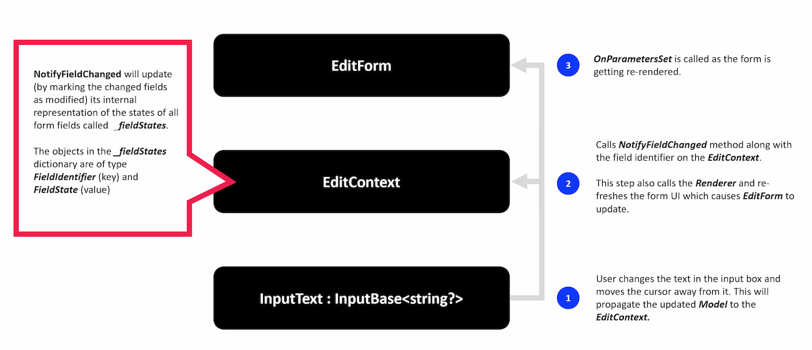

# Introducing Blazor Forms

Forms are a key of any web application as they provide a way to collect information from end-users. This information might range from the user details that we collect as part of a sign-up process down to a single textbox that allows users to leave comments or post messages in an collaborative application.

In this article we'll explain the benefits of Blazor forms, we'll look at their lifecycle and explain the fundamental concepts used to create and extend forms using Blazor.

The article is divided into the following sections:

1. [Form Fundamentals](#fundamentals)
2. [Introducing Blazor Forms](#blazor-forms)
3. [Blazor Component Model](#component-model)
4. [Extending Form Components](#extending-components)
5. [Validation](#validation)
6. [Extending Validation](#extending-validation)

## <a name="fundamentals"></a> Form Fundamentals

Let's assume that we are building a Contact form which has two fields (Name and Email) and a button to submit the form. In ASP.NET MVC, the code required to build such a form might look like this.

```html
<form asp-controller="Home" asp-action="Register" method="post">
  <label asp-for="Contact.Name" class="form-label">Name</label>
  <input asp-for="Contact.Name" class="form-control" type="text" />
  <span asp-validation-for="Contact.Name" class="text-danger"></span>

  <label asp-for="Contact.Email" class="form-label">Email address</label>
  <input asp-for="Contact.Email" class="form-control" />
  <span asp-validation-for="Contact.Email" class="text-danger"></span>

  <button class="btn btn-primary mt-3" type="submit">Submit</button>
</form>
```

The form defines an HTTP method and an endpoint to which the data is sent. It uses ASP.NET tag helpers to render the correct types of input controls and validation messages based on data annotations on the underlying `Contact` model.

One problem with this solution is that when the form submits, a full page refresh is required as the server now needs to send a full HTTP payload to the client. To avoid this, one could use the approach offered by SPA solutions which abstract and simplify common tasks such as managing the state of fragments of pages away from the developer.

However, the separation of client and server-side code introduces further complexity, such as needing to deal with data type differences and other mismatches between server and client components.

With Blazor, developers write end-to-end solutions using .NET. This removes the technology mismatches and provides the following benefits:

- The same data types are used through the entire roundtrip of a request
- No additional endpoints are needed to process form submissions
- No need to deal with intermediary formats such as JSON to pass data between the front and back-end
- Reusing validation code on the server and client

## <a name="blazor-forms"></a> Introducing Blazor Forms

Converting the previous form to Blazor results in the following code and markup.

```html
<EditForm Model="@Contact" OnSubmit="@FormSubmitted">
  <DataAnnotationsValidator />

  <label for="@nameof(Contact.Name)" class="form-label">Name</label>
  <InputText Class="form-control" @bind-Value="Contact.Name" />
  <ValidationMessage For="Contact.Name" />

  <label for="@nameof(Contact.Email)" class="form-label">Email</label>
  <InputText Class="form-control" @bind-Value="Contact.Email" />
  <ValidationMessage For="ContactModel.Email" />

  <button class="btn btn-primary mt-3" type="submit">Submit</button>
</EditForm>
```

Although the structure of the mark-up looks very similar for both the Blazor and MVC code, the key points to highlight in the Blazor code are:

- **EditForm** defines a Blazor component which renders a `<form>` element under-the-hood.

- The **Model** attribute lets us bind an object to our form which gets updated whenever we make changes to the form.

- **OnSubmit** configures a local method which gets triggered when the form is submitted. _Note: Blazor also provides us `OnValidSubmit` and `OnInvalidSubmit` convenience methods_.

- **InputText** a Blazor component representing a HTML `<input>` element. It uses the `@bind-Value` attribute to describe which property the component should bind to on the model.

- **DataAnnotationsValidator** and **ValidationMessage** elements attach our form to validation support and display any associated validation warnings to the user.

In the Blazor example, there is no separate Controller/Action and all code is written using C# and .NET.

## <a name="component-model"></a> Blazor Component Model

Now that we've seen how to structure a Blazor form, it's worth diving a little deeper to demystify the `EditForm` and its related child elements.

All Blazor form elements we've seen, including the [EditForm](https://github.com/dotnet/aspnetcore/blob/main/src/Components/Web/src/Forms/EditForm.cs), inherit from the abstract [ComponentBase](https://docs.microsoft.com/en-us/dotnet/api/microsoft.aspnetcore.components.componentbase?view=aspnetcore-5.0) class. This `EditForm` is the root source for [cascading](https://docs.microsoft.com/en-us/aspnet/core/blazor/components/cascading-values-and-parameters?view=aspnetcore-5.0) the EditContext and is the coordinator of the form's lifecycle and events.

Blazor builds on top of the `ComponentBase` class to provide us with a handy set of built-in components that align to each of the standard HTML input types. The base class for each of these is the `InputBase` class as shown in the following class hierarchy diagram.


At runtime, it is the `EditContext` that is responsible for handling events that fire in reponse to interactions and notifying all other elements in the form's component hierarchy. Each component then updates their state before the form is then re-rendered.



## <a name="extending-components"></a> Extending Form Components

There may be times where you need to create your own custom components. For example, it is common to use custom components to encapsulate and simplify repetitive chunks of code.

The following example shows a component to consolidate the repetitive markup that is required to render Bootstrap form element groups. This is done to make it easier to maintain the code and helps enforce consistency across an application.

```html
@inherits InputText

<div class="form-group">
  @if (!string.IsNullOrWhiteSpace(Label)) {
    <label class="form-control-label" for="@Id">@Label</label>
  }

  <InputText
    Class="form-control"
    placeholder="@Label"
    Value="@Value"
    ValueChanged="@ValueChanged"
    ValueExpression="@ValueExpression"
  ></InputText>
</div>
```

In this example we are simply extending from `InputText` which is the logical equivalent of a HTML input text element. This seems like a good fit as we are representing a single text input and extending from `InputText` saves us from having to write any additional code. You can extend from other classes in the inheritance hierarchy depending on your own specific customization needs.

Our custom `BootstrapInput` control is shown here in a form with a binding to the `ContactDetails.Name` property of the model.

```html
<EditForm Model="@ContactDetails" OnSubmit="@FormSubmitted">
  <BootstrapInput @bind-Value="ContactDetails.Name" />

  <button class="btn btn-primary mt-3" type="submit">Submit</button>
</EditForm>
```

Before building your own custom components, it's worth checking out the comprehensive range of third-party components that are available via NuGet. These include specialized libraries of components such as:

- [Blazored](https://github.com/Blazored) component library which includes controls that allow users to enter and view Markdown in forms
- [Telerik](https://www.telerik.com/blazor-ui)'s Blazor component is a comprehensive library of components that can be used to create very customized solutions
- [MudBlazor](https://mudblazor.com/) component library inspired by Google's Material design language and written entirely in C#

## <a name="validation"></a> Validation

In the Blazor form definition shown earlier, we saw that **DataAnnotationsValidator** and **ValidationMessage** elements had been added to the form to provide validation support based on [Data Annotations](https://docs.microsoft.com/en-us/dotnet/api/system.componentmodel.dataannotations?view=net-5.0).

```html
<EditForm Model="@ContactModel" OnValidSubmit="@FormSubmitted">
  <DataAnnotationsValidator />
  ...
</EditForm>
```

The following summary describes each of the built-in validation components that Blazor provides.

| Validation Component                                                                                                                                                                 | Usage                                                                                                                                                                                                            |
| ------------------------------------------------------------------------------------------------------------------------------------------------------------------------------------ | ---------------------------------------------------------------------------------------------------------------------------------------------------------------------------------------------------------------- |
| [`<ValidationSummary>`](https://docs.microsoft.com/en-us/dotnet/api/microsoft.aspnetcore.components.forms.validationsummary?view=aspnetcore-5.0)                                     | Show validation error messages as a group at a set position on the page                                                                                                                                          |
| [`<ValidationMessage>`](https://docs.microsoft.com/en-us/dotnet/api/microsoft.aspnetcore.components.forms.validationmessage-1?view=aspnetcore-5.0)                                   | Show validation error messages for an individual input element at set positions within the page                                                                                                                  |
| [`<DataAnnotationsValidator>`](https://docs.microsoft.com/en-us/dotnet/api/microsoft.aspnetcore.components.forms.dataannotationsvalidator?view=aspnetcore-5.0)                       | Applies validation rules based on Data Annotations at runtime                                                                                                                                                    |
| [`<ObjectGraphDataAnnotationsValidator>`](https://docs.microsoft.com/en-us/aspnet/core/blazor/forms-validation?view=aspnetcore-5.0#nested-models-collection-types-and-complex-types) | Applies validation rules similar to DataAnnotationsValidator except that it traverses nested properties within an object hierarchy of the given model. Note that this need to be added as a separate dependency. |

Each of the validation components has access to the `EditContext` and they use this to access and validate the `Model`. The validators maintain a store of error messages for each field associated with the form. You can see the code for how this is done [here](https://github.com/dotnet/aspnetcore/blob/edc1ca88e17e6cb60a5ea0966d751075d35111b9/src/Components/Forms/src/EditContextDataAnnotationsExtensions.cs#L36).

Form fields access the [ValidationMessageStore](https://github.com/dotnet/aspnetcore/blob/edc1ca88e17e6cb60a5ea0966d751075d35111b9/src/Components/Forms/src/ValidationMessageStore.cs) to check for errors when determining how to render their own state. The following image shows the Email field highlighted in red, indicating to the user that it is in an invalid state.


In addition to the field state warnings, you can add `ValidationMessage` and `<ValidationSummary>` components to display validation error messages to the user at relevant positions on the form. As you may have already guessed, these components also use the message store to gain access to validation messages.

## <a name="extending-validation"></a> Extending Validation

Styles... describe that we might want to customize the error styles to conform to our design system. This might be Bootstrap, Material UI, or our own custom design system.

```csharp
protected override void OnInitialized()
{
    _editContext = new EditContext(_contactDetails);
    _editContext.SetFieldCssClassProvider(new BootstrapStyleProvider());
    _editContext.OnFieldChanged += HandleFieldChanged;
}
```

Rules - if we want additional validation logic other than DataAnnotations, we can write our own custom validator and handle validation events from the `EditContext` to use our own logic to write errors to the message store.

https://github.com/Blazored/FluentValidation
https://chrissainty.com/using-fluentvalidation-for-forms-validation-in-razor-components/

```csharp
public class CustomValidator : ComponentBase
{
    [CascadingParameter] EditContext CurrentEditContext { get; set; }

    protected override void OnInitialized()
    {
        var messages = new ValidationMessageStore(CurrentEditContext);
        CurrentEditContext.OnValidationRequested +=
    (sender, eventArgs) => ValidateModel((EditContext)sender, messages);

        CurrentEditContext.OnFieldChanged +=
    (sender, eventArgs) => ValidateField(editContext, messages, eventArgs.FieldIdentifier);
    }

    // TO DO: provide your own logic for doing model and field validation
}
```

## Wrapping it up

In this article we have given an overview of the fundamental concepts of Blazor forms.

We compared ASP.NET MVC forms to Blazor forms. We then looked at the fundamental concepts required to understand how to use form inputs and validation and saw how to extend and customize them to our own needs.
